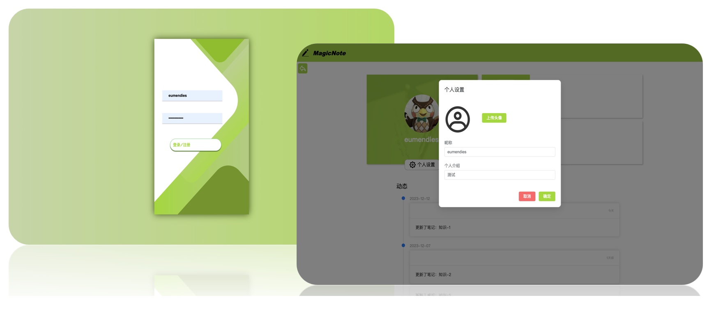
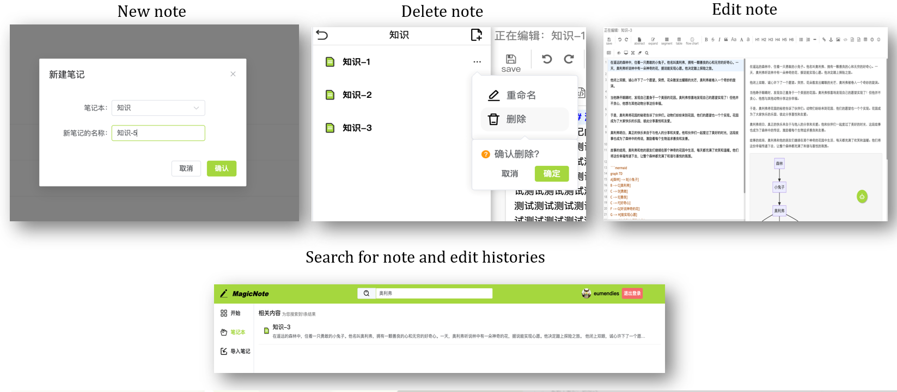
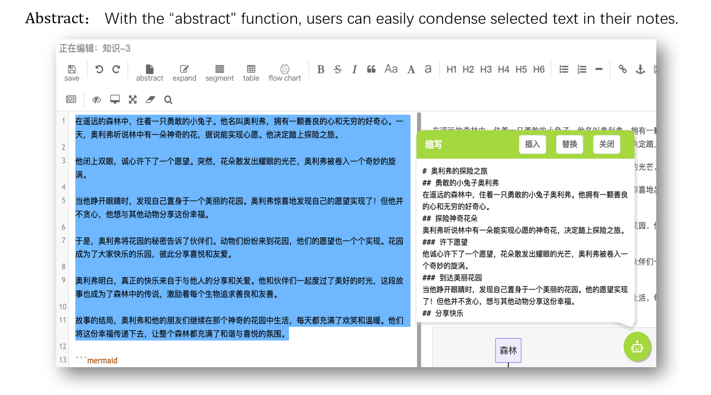
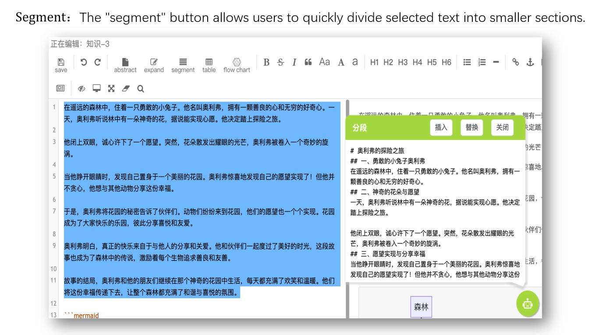
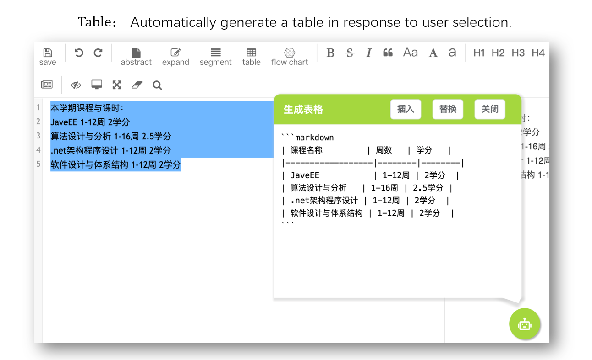
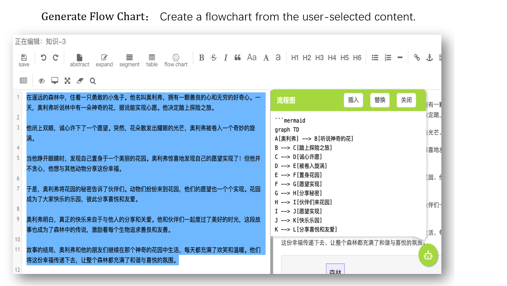
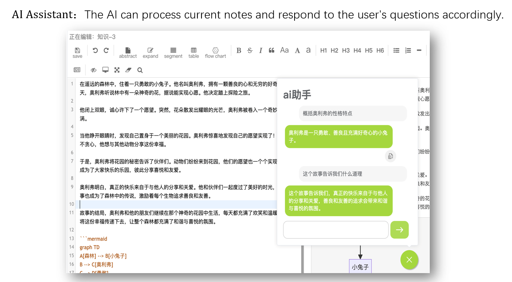
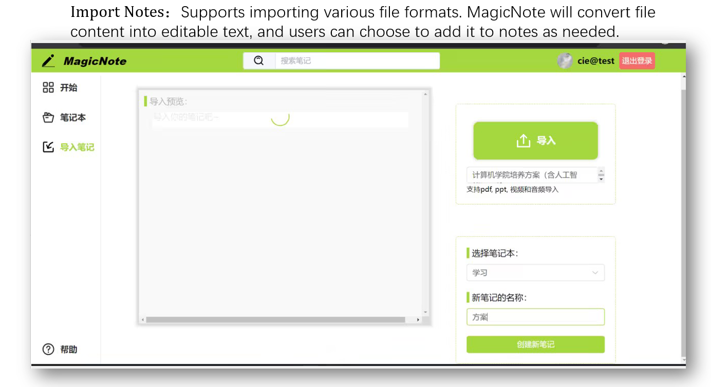

# javaEE大作业

#### 小组分工

+ 易杰（Jerome_YJ）：后端编写。主要负责后端的部分框架的搭建；后端中部分service、controller的编写；数据库中关系的设计与数据库维护；Markdown编辑器中图片上传功能实现；全局搜索功能的实现；AI辅助笔记中各功能的实现，多种大语言模型的调用与调试；AI笔记问答功能的实现；AI问答与AI辅助功能中流式输出、逐字输出SSE实现等。
+ 慈恩(susong):后端编写。主要负责后端的部分框架的搭建；后端中部分controller，service以及security，exception的编写；通过docker部署minio实现文件存储与操作；部署OCR模型tesseract实现图片文字识别；在云服务器上部署Whipser实现音视屏文字转换；实现AI功能中生成表格与生成流程图的调用与调试。
+ 刘志锋（Eumendies）：前端编写。主要负责前端项目框架搭建；主页面、用户页面、侧边栏、搜索结果页面、AI悬浮球、帮助页面的样式布局设计和前端代码编写；登录注册、修改用户名、头像、个性签名API的调用与调试；笔记本和笔记的增、删、查、改名API的调用与调试。
+  张弘毅（potter-Zhang）：前端编写。主要负责前端AI和编辑器方面的搭建；登录注册界面设计，编辑器的导入和工具栏扩展，导入笔记界面，AI悬浮球；AI笔记扩展功能的流式API，导入各类富文本资源API，图片上传API的调用和调试，AI笔记对话功能的编写，笔记内容的同步与保存。

### JavaEE Project - Group Responsibilities
**This is an AI-Enhanced Intelligent Note-Taking Website Project.**

**Jerome Yi (易杰): Backend Development**
   - Primary responsibilities include setting up parts of the backend framework; developing specific services and controllers; designing and maintaining database relationships.
   - Implemented image upload functionality within the Markdown editor and developed a global search feature.
   - Led the development of AI-assisted note-taking functions, integrating multiple large language models (LLMs), and implemented the AI note Q&A feature.
   - Enabled streaming output and character-by-character output in the AI Q&A and AI assistance functions through Server-Sent Events (SSE).

**Susong Ci (慈恩): Backend Development**
   - Focused on backend framework setup, including development of controllers, services, security, and exception handling.
   - Set up MinIO for file storage and operations using Docker, and deployed the OCR model Tesseract for image text recognition.
   - Deployed Whisper on a cloud server to convert audio and video to text.
   - Integrated and debugged table generation and flowchart creation within the AI functions.

**Eumendies Liu (刘志锋): Frontend Development**
   - Led the frontend project framework setup and designed and implemented layouts for the main page, user page, sidebar, search results page, AI floating widget, and help page.
   - Integrated and debugged APIs for login, registration, username changes, profile picture updates, and personalized signatures.
   - Developed and tested APIs for notebook and note management, including adding, deleting, renaming, and searching.

**Potter Zhang (张弘毅): Frontend Development**
   - Focused on the development of AI-related front-end components and the editor.
   - Designed the login and registration interfaces, integrated the editor and extended its toolbar, and implemented the import notes page and AI floating widget.
   - Developed and debugged streaming APIs for AI note extension features, integrated APIs for importing various rich text resources, image upload, and developed the AI conversation feature for notes, as well as synchronization and saving of note content.

## Features and Screenshots

